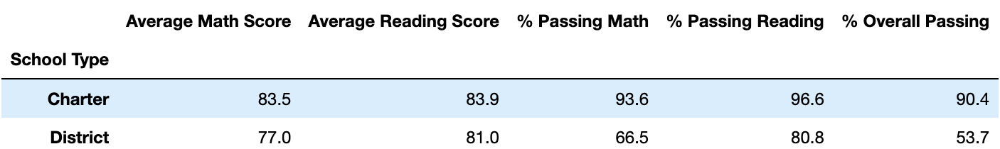

# School_District_Analysis
Python, Anaconda Pandas & Jupyter Notebook - Perform school district analysis
Overview of the school district analysis

## Project Overview
The school board has notified Maria and her supervisor that the students_complete.csv file shows evidence of academic dishonesty; specifically, reading and math grades for Thomas High School ninth graders appear to have been altered. Although the school board does not know the full extent of the academic dishonesty, they want to uphold state-testing standards. In this project, math and reading scores is replaced for Thomas High School with NaNs while keeping the rest of the data intact. Then, repeat the school district analysis and write up a report to describe how these changes affected the overall analysis.

An overview of the key metrics for each school, presented in a table format
Tables presenting each of the following metrics:

1. Generate per_school_summary_df for all schools
2. Replace Thomas High School 9th grader test results to "nan" 
3. Run analysis exclude 9th grade for Thomas High School in % Passing Math, % Passing Reading and % Overall Passing
4. Update per_school_summary_df
5. Top 5 and bottom 5 performing schools, based on the overall passing rate
6. The average math score received by students in each grade level at each school
7. The average reading score received by students in each grade level at each school
8. School performance based on the budget per student
9. School performance based on the school size
10. School performance based on the type of school

## School District Analysis Results
- After replacing 9th graders test result, the student size for Thomas High School has decreased from 1635 to 1174. 
-The district summary overall passing percentage has dropped 0.1% 
-Thomas high school's summary has been increased (Before & After)
   
   
-Thomas High School’s performace is still reminded in top 2 compared to others.
### Replacing the ninth-grade scores affect the following:
- Math and reading scores by grade  
  9th grade math and reading score has replaced to "nan" which will not included from the following analysis, 
  others reminded the same
- Scores by school spending (Before & After)  
  Thomas High School per student budget is $638 which falls in range of $630-644
   
    
- Scores by school size (Before & After)  
  Thomas High School has total students of 1635 which falls in range of 1000-2000
   
   
- Scores by school type (Before & After)  
  Thomas High School type is Charter
   
   

## Summary

- After reading and math scores for the ninth grade at Thomas High School have been replaced with NaNs, student sample size has decreased. Anything that related to Thomas High School has affacted changes in analysis result as the math, reading and overall passing score has count into the analysis: 
  - Increased 25.53% in overall scores Thomas High School grades 
  - Increased 6.4% overall scores in school with per student budget range between $630-644
  - Increased 5.2% overall scores in school students range between 1000 to 2000 
  - Increased 3.2% overall scores in Charter school type
